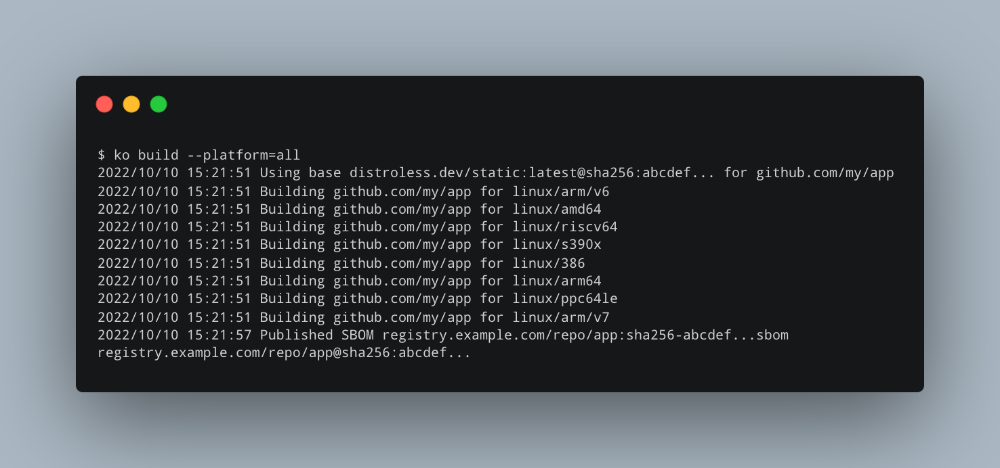

# `ko`: Easy Go Containers

---

> 🎉 Google has applied for `ko` to join the Cloud Native Computing Foundation as a Sandbox project! Learn more [here](https://opensource.googleblog.com/2022/10/ko-applies-to-become-a-cncf-sandbox-project.html)!

`ko` is a simple, fast container image builder for Go applications.

It's ideal for use cases where your image contains a single Go application
without any/many dependencies on the OS base image (e.g., no cgo, no OS package
dependencies).

`ko` builds images by effectively executing `go build` on your local machine,
and as such doesn't require `docker` to be installed. This can make it a good
fit for lightweight CI/CD use cases.

`ko` makes [multi-platform builds](https://ko.build/features/multi-platform/) easy, produces [SBOMs](https://ko.build/features/sboms/) by default, and includes support for simple YAML templating which makes it a powerful tool for [Kubernetes applications](https://ko.build/features/k8s/).

# [Install `ko`](https://ko.build/install/) and [get started](https://ko.build/get-started/)!

### Acknowledgements

This work is based heavily on experience from having built the [Docker](https://github.com/bazelbuild/rules_docker) and [Kubernetes](https://github.com/bazelbuild/rules_k8s) support for [Bazel](https://bazel.build).
That work was presented [here](https://www.youtube.com/watch?v=RS1aiQqgUTA).

### Discuss

Questions? Comments? Ideas?
Come discuss `ko` with us in the `#ko-build` channel on the [Kubernetes Slack](https://slack.k8s.io)!
See you there!

### Community Meetings

You can find all the necessary details about the community meetings in this [page](https://ko.build/community).
